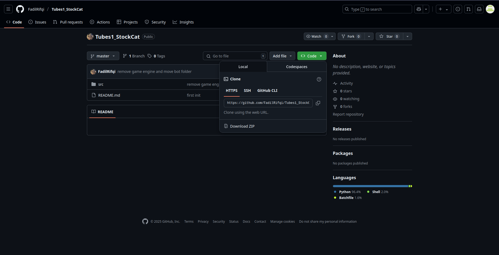

## Tubes 1 Stigma

### Nama: Muhammad Fadil Ataullah Rifqi

### NIM: 122140205

## Penjelasan Algoritma

### StockCat

#### Strategi bot yang dikembangkan menggunakan pendekatan Greedy by Density dengan mempertimbangkan menggunakan teleporter

## Cara Menjalankan Bot

#### 1. Clone atau Download Repository

##### Clone atau download zip repository

```sh
 git clone https://github.com/FadilRifqi/Tubes1_StockCat.git
```

##### atau bisa di download melalui [Github](github.com/FadilRifqi/Tubes1_StockCat/)



#### 2. Masuk Ke Folder Src

##### Setelah clone masuk ke folder src dengan cara

```sh
cd Tubes1_StockCat/Src
```

#### 3. Install Requirements

##### Install Python requirements dependencies atau jika sudah install lewati

##### Pakai venv

```sh
python -m venv .venv
source .venv/bin/activate
pip install -r requirements.txt
```

##### Tanpa Venv

```sh
pip install -r requirements.txt
```

#### 4. Jalankan bot

##### Jalankan bot dengan cara

```sh
python main.py --logic StockCat --email=stockcat@email.com --name=stockcat --password=123456 --team etimo --board 9
```

##### Sesuaikan email, name, password, dan board (bebas)

#### 5. Jalankan di Template Bot Lain

##### Jika hanya ingin mengambil algoritma [stockcat](src/game/logic/stockcat.py) saja maka lakukan seperti berikut

##### 1. Copy File [stockcat](src/game/logic/stockcat.py) ke dalam folder game/logic

##### 2. Import pada main file

```python
from game.logic.stockcat import StockCat
```

##### Kemudian daftarkan pada class CONTROLLERS pada main file

```python
CONTROLLERS = {
    ...,
    "StockCat": StockCat,
}
```

##### Lalu jalankan seperti nomor 4
